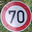
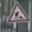
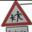
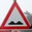
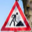
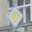

# **Traffic Sign Recognition**

---

In this project, I design a deep learning model to recognize traffic signs from the [German Traffic Sign Dataset](http://benchmark.ini.rub.de/?section=gtsdb&subsection=dataset). The model, similar to AlexNet, is 5 convolutional layers followed by 2 fully connected layers. The dataset used is a subset of The German Traffic Sign Detection Benchmark. provided by Udacity.

All code is in the [Jupyter Notebook](https://github.com/csharpseattle/CarND-Traffic-Sign-Classifier/blob/master/Traffic_Sign_Classifier.ipynb)

The goals / steps of this project are the following:
* Load the data set (see below for links to the project data set)
* Explore, summarize and visualize the data set
* Design, train and test a model architecture
* Use the model to make predictions on new images
* Analyze the softmax probabilities of the new images
* Summarize the results with a written report

[//]: # (Image References)
[image1]: ./writeup_images/training_distribution.png "Training Distribution"
[image2]: ./writeup_images/random_sample.png "Dataset sample"
[image3]: ./writeup_images/augmented_distribution.png "Distribution after augmentation"
[image4]: ./writeup_images/augmentation_example.png "Augmentation example"
[image5]: ./writeup_images/internet_signs.png "Signs found on the internet."
[image6]: ./writeup_images/layer2_vis.png "Visualization of conv layer 2."

## Dataset Summary and Exploration

The dataset used is a subset of the [_German Traffic Sign Dataset_](http://benchmark.ini.rub.de/?section=gtsdb&subsection=dataset).  In the first 4 code cells of the Jupyter notebook the data is loaded from the provided pickle files and numpy and matplot are used to gain insight into the data set:

Total examples = 51839 
Number of training examples = 34799 
Number of validation examples = 4410 
Number of testing examples = 12630 
Image data shape = (32, 32) 
Number of classes = 43 

Matplot is used to show the split of train, test, and validation sets.  Also the distribution of traffic signs across the 43 classes is plotted:

![alt text][image1]

The pickled files provided contained a total of 51839 examples taked from the German traffic sign dataset. Training and Validation together make up roughly 75% of the total. About 25% of the examples are reserved for testing. All examples are 32x32 in size and spread across 43 classes.

In code cell 5, 43 random samples are taken from the training dataset, one from each class. We can see that although all examples are 32x32 pixels square, they are of differing illumination and signs in the images are not all the same size and shape.

![alt text][image2]

### Pre-processing of the Data Set 

Several pre-processing techniques were attempted. Among these were converting to YUV color space, just the Y channel [1], Local Contrast Normalization[2], and simple RGB color data. In the end I found the best results with grayscale. Image data is then normalized so that the data has mean zero and equal variance. The mean is subtracted from each pixel and the result is divided by the standard deviation. All values are then shifted to be between 0 and 1

In addition to grayscale data, a large increase in validation accuracy was obtained by augmenting the dataset by scaling, translating, and rotating existing images. Random scaling was performed to 0.9 and 1.1 times the original size, translation of +/- 2 pixels in the x and y directions, and random rotation between -15 and 15 degrees. Values were obtained from [1]. During data augmentation the uneven distribution of the training set was addressed. The number of examples generated was calculated such that all sign types had even distribution. Augmenting all classes to 1.5 times the count of the maximum class brings the training set up to nearly 130K examples.

After augmentation we can see the distribution has been evened out:

![alt text][image3]

Code cell 6 defines the functions for preprossing and augmentation of the dataset.  Cell 7 is code to plot an augmentation example:

![alt text][image4]

The first image in the list is the original and the following 8 images are derived from it by scaling, rotation, and or translation.

### Model Architecture

Design and implemention went through many iterations. The process of determining the correct layers, kernel sizes, strides, etc., feels to be a largely empirical process. LeNet-5 was used as a starting point and provided validation accuracy around 88%. Following Sermanet and LeCun[1], I achieved over 95% validation accuracy by feeding grayscale images to a 2 layer convolution neural network followed by 2 fully connected layers with the output of both convolutional layers concatenated and fed into the fully connected layers.

Attempting to achieve even better accuracy, I added an Inception layer to the modified LeNet. Although training time increased significantly, accuracy did not. After many iterations and training time I finally decided upon a model much like AlexNet[3] though modified to have a smaller number of parameters. Final validation accuracy was 99.2%

There were several aspects of the architecture that had large effects on validation accuracy or convergence. The first was the augmentation of the dataset. This provided a noticeable jump in accuracy across all models. Another was the learning rate. A small change in the learning rate can have a big difference on the time it took for a model to reach top accuracy. In some cases an incorrect learning rate would keep the network from converging at all. I tried several different optimizers, with and without learning rate decay, and found that AdamOptimizer worked best for this situation. The Number of epochs varied across models. The deeper models with more layers required more epochs to reach their maximum accuracy.

The model architecture is in Code cell 8 of the Jupyter notebook.

#### Final Model

| Layer                 |     Description                               |
|:---------------------:|:---------------------------------------------:|
| Input                 | 32x32x1 Grayscale image                       |
| Convolution 3x3       | 1x1 stride, valid padding, outputs 30x30x32   |
| RELU					|												|
| Convolution 3x3       | 1x1 stride, valid padding, outputs 28x28x60   |
| RELU					|												|
| Max pooling           | 2x2 stride,  outputs 14x14x60                 |
| Dropout               | keep probability 0.5 during training          |
| Convolution 3x3       | 1x1 stride, valid padding, outputs 12x12x75   |
| RELU					|												|
| Convolution 3x3       | 1x1 stride, valid padding, outputs 12x12x100  |
| RELU					|												|
| Max pooling           | 2x2 stride,  outputs 5x5x100                  |
| Dropout               | keep probability 0.5 during training          |
| Convolution 3x3       | 1x1 stride, valid padding, outputs 3x3x125    |
| Fully connected		| Input 1125, output 1024                       |
| RELU					|												|
| Fully connected		| Input 1024, output 43                         |
| Dropout               | keep probability 0.5 during training          |

My final model results were:
* training set accuracy of 1.000
* validation set accuracy of 0.992
* test set accuracy of 0.979

Training and testing of the Model are performed in Code cells 9-11.

### Test a Model on New Images

Here are traffic signs that I found on the web:

![alt text][image5]

I thought the change in illumination across many of the images would give the classifier trouble. One of the stop signs has a streak across it and the 70 km speed limit has a shine on 1/4 of the sign.  I threw in 4 triangular signs: 2 Road Work, 1 Children crossing, and 1 Bumpy Road.  The signs that I really thought would fool the classifier were the smaller Road Work sign and the Priority Road sign.  These 2 signs were actually taken from video footage recorded by a friend driving in the Czech Republic.  The resolution is worse than the other signs and the angle of the shot is far from straight on.  I also thought the dull color of the images would be a problem.

#### 2. Predictions

Code cell 12 shows the images found on the internet.  Code cell 13 runs the predictons for each and Code cell 14 outputs the top-5 Softmax probabilities for each.

The model was able to correctly guess all of the traffic signs, which gives an accuracy of 100%. This compares favorably to the accuracy on the test set of 97.9%

Here are the signs with the top-5 predictions for each:

<table><tr><td style="text-align: center;">
 
</td><td>
 
</td><td>
 
</td><td>
 
</td><td>
 
</td><td>
 
</td><td>
 
</td><td>
 
</td><td>
 
</td></tr><tr><td style="text-align: center;">Stop   (100.0%)</td><td>Stop   (100.0%)</td><td>Speed limit (70km/h)   (100.0%)</td><td>Turn right ahead   (99.7%)</td><td>Road work   (99.8%)</td><td>Children crossing   (100.0%)</td><td>Bumpy road   (99.9%)</td><td>Road work   (100.0%)</td><td>Priority road   (100.0%)</td></tr><tr><td style="text-align: center;">Yield   (0.0%)</td><td>Turn right ahead   (0.0%)</td><td>Speed limit (20km/h)   (0.0%)</td><td>Ahead only   (0.2%)</td><td>Road narrows on the right   (0.2%)</td><td>Right-of-way at the next intersection   (0.0%)</td><td>Bicycles crossing   (0.1%)</td><td>Road narrows on the right   (0.0%)</td><td>No vehicles   (0.0%)</td></tr><tr><td style="text-align: center;">Speed limit (70km/h)   (0.0%)</td><td>Yield   (0.0%)</td><td>Speed limit (30km/h)   (0.0%)</td><td>No passing for vehicles over 3.5 metric tons   (0.1%)</td><td>Roundabout mandatory   (0.0%)</td><td>Road work   (0.0%)</td><td>Road work   (0.0%)</td><td>Right-of-way at the next intersection   (0.0%)</td><td>Speed limit (50km/h)   (0.0%)</td></tr><tr><td style="text-align: center;">Turn right ahead   (0.0%)</td><td>Speed limit (60km/h)   (0.0%)</td><td>General caution   (0.0%)</td><td>Speed limit (80km/h)   (0.0%)</td><td>Dangerous curve to the right   (0.0%)</td><td>Beware of ice/snow   (0.0%)</td><td>Road narrows on the right   (0.0%)</td><td>Children crossing   (0.0%)</td><td>Yield   (0.0%)</td></tr><tr><td style="text-align: center;">Speed limit (30km/h)   (0.0%)</td><td>Speed limit (70km/h)   (0.0%)</td><td>Traffic signals   (0.0%)</td><td>End of no passing by vehicles over 3.5 metric tons   (0.0%)</td><td>Go straight or left   (0.0%)</td><td>Wild animals crossing   (0.0%)</td><td>Priority road   (0.0%)</td><td>Ahead only   (0.0%)</td><td>Speed limit (30km/h)   (0.0%)</td></tr></table>

#### 1. Discuss the visual output of your trained network's feature maps. What characteristics did the neural network use to make classifications?

Code cell 15 outputs the test image used for visualizing the output and Code cell 16 plots the output.

From the 60 feature map plots we can see that the neural network used the triangular outline of the sign in addition to the icon of the 2 bumps on the bottom of the sign to make the classification.

![alt text][image6]
